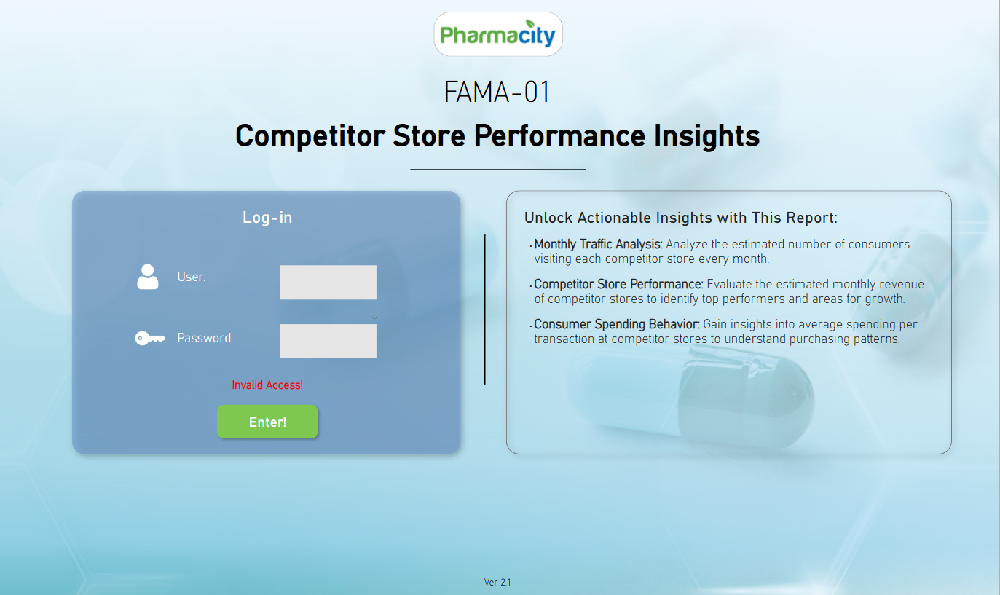
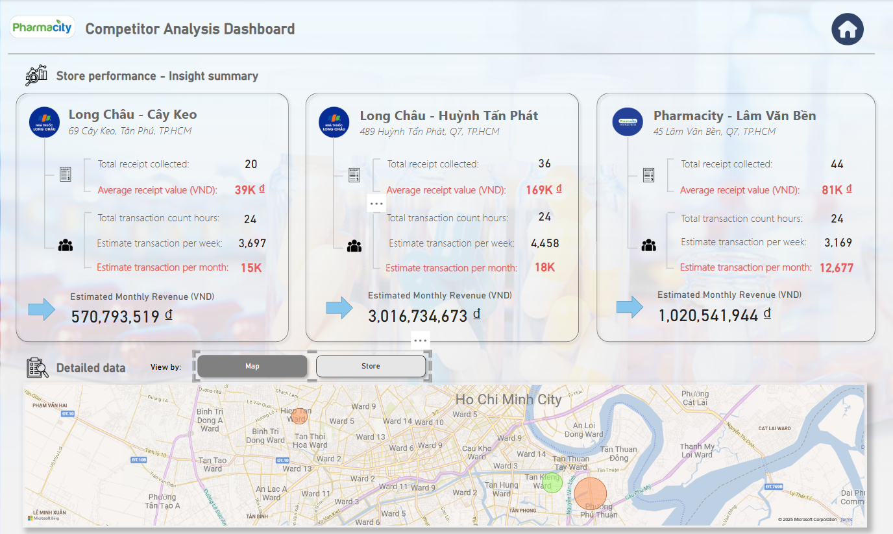
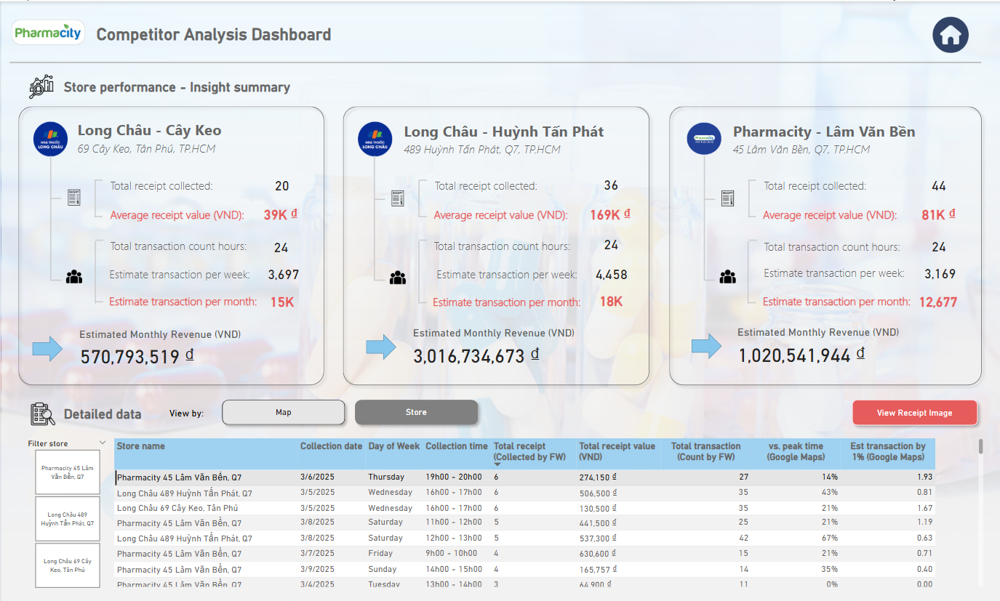
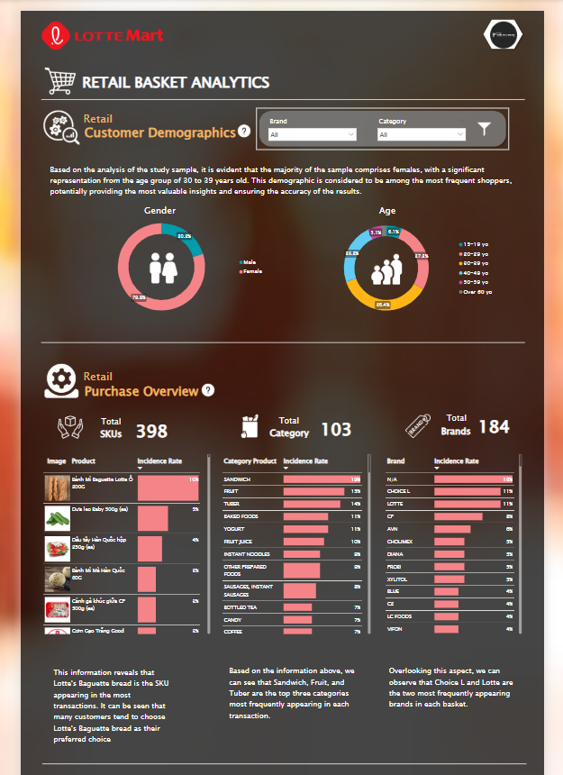
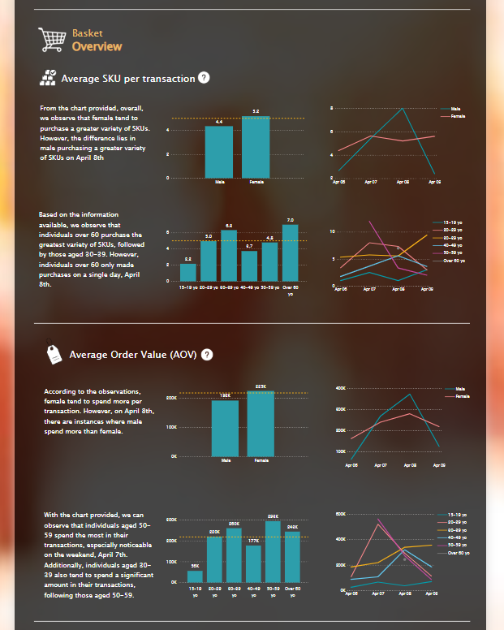
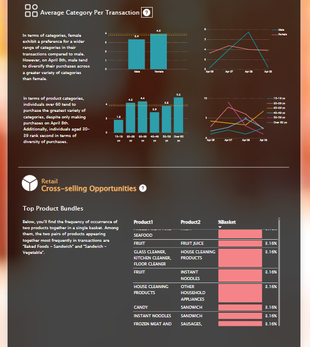
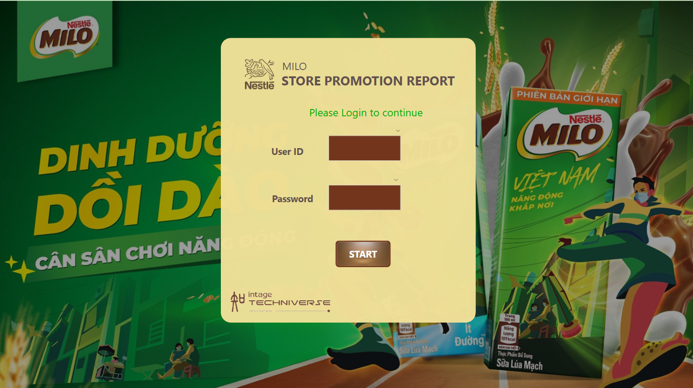
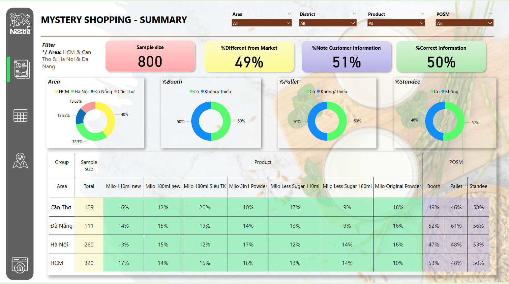
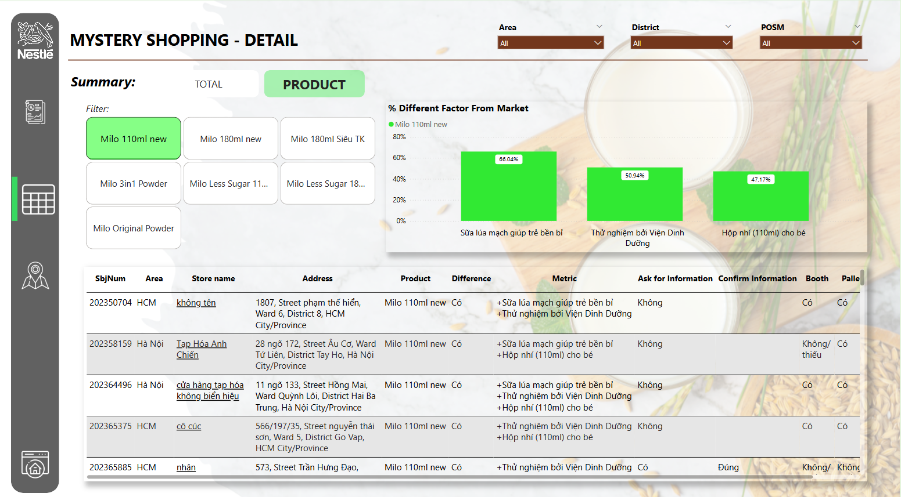
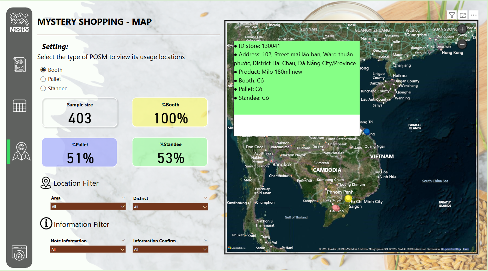

# Dashboard's Portfolio
*For confidentiality reasons related to previous projects, the data (brand) shown is fake and for reference only.*
# [Project 1: Competitor Analysis Dashboard]
## *Project Overview:*
Data were gathered through an audit approach — collecting receipts, counting customer traffic in predefined time slots agreed with the client, scanning each receipt with the company tool, and capturing all key fields.
## *My Role:*
- Clarified Client's requirements and desired outputs.
### Cleaning Data:
- Cleaned ~100 receipts over a two-week collection period.
- Reviewed video footage to tally store foot traffic.
- Used Power Query to re-clean the dataset and set proper data types.
### Building model and creating Dashboard:
- Built a data model, dimenstion to establish relationships for analysis.
- Wrote DAX measures, drill through to create interactive dashboards and give insights.
## *Output:*
- Estimated weekly and monthly revenue
- Estimated weekly and monthly traffic
## *Dashboard:*
### Log-in Page

### Analytics Page

### Detailed Page

### Tooltip Page

# [Project 2: Retail Basket Analytics]
## *Project Overview:*
Project used an in-house app (with AI OCR) to collect user receipts.
## *My Role:*
### Data cleaning & mapping
- Standardized and mapped ~550 receipts to the product master list.
- Created new master records (industry / category / class / sub-class) for unmapped items.
- Coordinated with teammates to load the cleaned data into SQL.
### Dashboard build
- Queried SQL as the single source for Power BI.
- Performed one-time data shaping in Power Query.
- Wrote DAX measures, built visuals, and extracted insights.
## *Output:*
- Customer demographics
- Purchase overview: incidence rate by product, category, and brand
- Average SKUs per transaction
- Average order value
- Average categories per transaction
- Cross-selling analysis (co-occurrence rate of two products in one basket)
## *Dashboard:*

# [Project 3: Store Promotion Report]
## *Project Overview:*
Collected store-level data through mystery shopping: surveyed sellers on Milo SKU prices (per client brief) and recorded whether POSM materials (standee, booth, pallet) were present.
## *My Role:*
- Built the dimensional model and relationships for the dashboard.
- Wrote DAX measures to compute KPIs and surface insights.
- Leveraged tooltips for quick, in-context data views.
## *Output:*
- Presence rates of Milo SKUs and POSM types across stores.
- Sellers’ perceptions of Milo products compared with market alternatives.
## *Dashboard:*
### Log-in Page

### Summary Page

### Detail Page

### MAP Page

