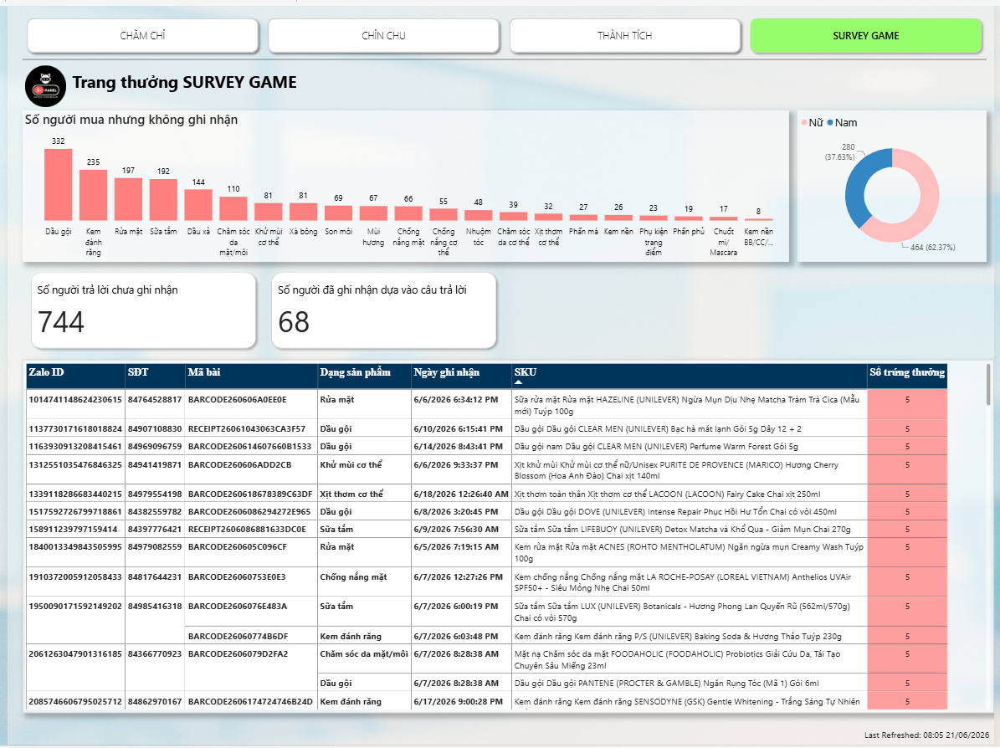

# DASHBOARD'S PORTFOLIO
*❗For confidentiality reasons related to previous projects, the brand data shown is fictional and for illustrative purposes only. Consequently, insights derived from this data may not reflect actual market realities.*
# 💡ABOUT ME
I'm a curious and dedicated data lover, always eager to learn and quick to pick up new skills — getting a burst of energy every time I dive into something new. I enjoy turning raw data into clear insights about customer experience and behavior.

**Short-term:** Build a strong grasp of the Data Analyst workflow and ETL process, while quickly mastering SQL, Power BI, Python, and other tools. Use my energy and curiosity to contribute to company and stakeholder projects, delivering insights that support better business decisions and smarter choices for customers.

**Long-term:** Become a Senior Data Analyst who builds customer insight platforms and drives business growth through user feedback. Grow into a T-shaped professional — broadening my knowledge across data, AI, and BI while developing deep expertise in these areas. I also aim to expand my skill set in programming languages such as Python, SQL, and R, and learn to work with APIs (e.g., RESTful APIs) to automate data pipelines and integrate external data sources into analysis workflows.

# --------------------------------

# 🧾Main Project: Shopper Receipt Tracking & Behavior Analytics
# ================================
*Status: Ongoing — continuously running panel project*

## *Project Overview:*
An ongoing, continuously running panel project (with no fixed end date) that captures shopper purchase behavior through receipt uploads. Panelists scan and upload their receipts via a mobile app built in collaboration with the team. Each receipt is then parsed and cleaned through an internally built web tool, capturing line-level details: SKU, purchase date and time, amount spent, quantity per SKU, and store name... This continuous stream of transaction-level data powers ongoing analysis of brand performance, basket composition, and shopper journeys.

## *My Role:*
- Designed the data capture flow for the app — defining what fields and what level of detail (SKU, quantity, price, timestamp, store...) needed to be recorded so the data was analysis-ready and aligned with client requirements.
- Built the dashboard that turns the continuously incoming receipt data into trend, ranking, and behavioral insights.
- Ran ad-hoc analyses and additional custom metrics whenever the standard dashboard views weren't enough to clarify a specific business question from the client.
- Authored periodic reports, translating dashboard numbers into a data narrative for stakeholders.

## *Analysis covered:*
- **Trend analysis** — purchase volume and spend trends over time, by brand/category
- **Co-purchase / market basket analysis** — which SKUs and brands are bought together
- **Brand & SKU ranking** — share of wallet, penetration, repeat purchase rate
- **Shopper behavior & journey** — purchase frequency, store preference, switching patterns over time
- etc.

## *Dashboard:*
*⚠️ Note: This is a live, ongoing client project. Real dashboard screens cannot be shared due to data privacy. The screenshots below are self-captured samples with all sensitive data masked/replaced, shown only to illustrate the structure and design of the dashboard.*

### *App used to collect data:*

# 🔥Panel Operations Mini-Dashboard (Users Uploading Streak)
# ================================
*Internal ops tool · supports [Main Project – Shopper Receipt Tracking & Behavior Analytics](#project-1)*

## *Project Overview:*
A small, focused mini-dashboard built as an operational support tool for the receipt-tracking panel in the Main Project. Rather than being a standalone analytics deliverable, it's used internally to monitor panelist data quality and eligibility — making sure the upstream receipt data feeding the Main Project's trend, co-purchase, and ranking analysis comes from active, qualified panelists. The dashboard identifies panelists meeting operational criteria, such as:
- *Uploading more than 10 receipts within 30 days*
- *Participating for more than 7 days*
- *Having a rejection rate below 20%*
- *Not being included in the blocked respondents list*
- *v.v*
## *My Role:*
- Received the requirements and held detailed discussions with the team to fully understand their needs.
- Requested data sourcing from the team via Power BI dataflows, pulled from the team's database.
- Used Power Query to clean and format the data for analysis (e.g., filtering out blanks in the Phone field, creating a dim_calendar table, sorting by MonthYear or WeekNum, etc.).
- Applied DAX functions to analyze the data according to specified criteria, using Row Context or Measures depending on the result needed.

## *Output:*
A monthly list of qualified panelists within specified time periods, used to keep the Main Project's panel composition clean and eligible.

## *Dashboard:*
### First Version
This version uses HTML to customize the streak calculation, displaying streaks by week within specific timeframes. However, since users need to download Excel files, it has to fall back to raw data.

### First Version - QC Page
This is a drill-through page used for quality control, allowing checks on previously selected panelists.

### Second Version
This page has been adjusted according to user requirements and is currently filtered to display all panelists.

### Second Version - Filtered
This page is filtered to show the panelists with the highest streaks in June.

This is the page where users requested additional conditions to calculate streaks for individual panelists.

### Recent Version - More Requirements
This version adds further conditions for panelists to upload receipts, and rewards them once they meet the validity criteria.

# ✅Data Quality Check Dashboard
# ================================
*Internal ops tool · supports [Main Project – Shopper Receipt Tracking & Behavior Analytics](#project-1)*

## *Project Overview:*
A guided dashboard built for non-technical team members to review and clean incoming receipt data, section by section, before it is pushed to the official Main Project dashboard. It checks that every data section has been updated daily and flags any cleaning steps that are still outstanding, so data issues are caught and resolved before they ever reach stakeholders.

## *My Role:*
- Mapped out the data sections that needed daily cleaning and defined a clear checklist for each one, based on the most common issues found in raw receipt uploads (e.g., Wrong SKU mapping, cheating uploading, Inappropriated uploading).
- Designed a simple, guided interface so non-technical users could clean data correctly without needing to understand the underlying queries or DAX logic.
- Built daily freshness checks to confirm each section's data had been updated as expected, flagging any section that fell behind.
- Set up action-based status indicators tied to each cleaner's actions on every section, using this status log as the basis for calculating each cleaner's pay — ensuring they were compensated accurately for the work they actually completed.

## *Output:*
A daily-updated checklist showing the cleaning status of every data section, giving the team confidence that only clean, complete data reaches the official Main Project dashboard.

## *Dashboard:*
### Daily Status Overview

# --------------------------------
# 📊Project 2: Competitor Analysis Dashboard
# ================================
### Project Workflow & Business Tasks

## *Dashboard:*
### Log-in Page

### Analytics Page

### Detailed Page

### Tooltip Page

# 🛍️Project 3: Retail Basket Analytics
# ================================
### Project Workflow & Business Tasks

## *Dashboard:*

# 🏷️Project 4: Store Promotion Report
# ================================
## *Project Overview:*
Collected store-level data through mystery shopping: surveyed sellers on Milo SKU prices (per the client brief) and recorded whether POSM materials (standee, booth, pallet) were present.

## *My Role:*
- Built the dimensional model and relationships for the dashboard.
- Wrote DAX measures to compute KPIs and surface insights.
- Used tooltips for quick, in-context data views.

## *Output:*
- Presence rates of Milo SKUs and POSM types across stores.
- Sellers' perceptions of Milo products compared with market alternatives.

## *Dashboard:*
### Log-in Page

### Summary Page

### Detail Page

### Map POSM Distribution Page

