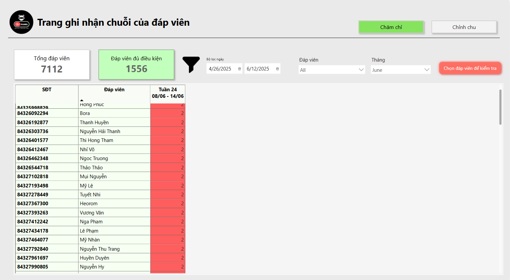

# Dashboard's Portfolio
*❗For confidentiality reasons related to previous projects, the brand data shown is fictional and for illustrative purposes only. Consequently, insights derived from this data may not reflect actual market realities.*
# 📊Project 1: Competitor Analysis Dashboard
# ================================
## *Project Overview:*
Data were gathered through an audit approach — collecting receipts, counting customer traffic in predefined time slots agreed with the client, scanning each receipt with the company tool, and capturing all key fields.
## *My Role:*
1. Clarified Client's requirements and desired outputs.
2. Cleaning Data:
- Cleaned ~100 receipts over a two-week collection period.
- Reviewed video footage to tally store foot traffic.
- Used Power Query to re-clean the dataset and set proper data types.
3. Building model and creating Dashboard:
- Built a data model, dimenstion to establish relationships for analysis.
- Wrote DAX measures, drill through to create interactive dashboards and give insights.
## *Output:*
- Estimated weekly and monthly revenue
- Estimated weekly and monthly traffic
## *Dashboard:*
### Log-in Page

### Analytics Page

### Detailed Page

### Tooltip Page

# 🛍️Project 2: Retail Basket Analytics
# ================================
## *Project Overview:*
Project used an in-house app (with AI OCR) to collect user receipts.
## *My Role:*
1. Data cleaning & mapping
- Standardized and mapped ~550 receipts to the product master list.
- Created new master records (industry / category / class / sub-class) for unmapped items.
- Coordinated with teammates to load the cleaned data into SQL.
2. Dashboard build
- Queried SQL as the single source for Power BI.
- Performed one-time data shaping in Power Query.
- Wrote DAX measures, built visuals, and extracted insights.
## *Output:*
- Customer demographics
- Purchase overview: incidence rate by product, category, and brand
- Average SKUs per transaction
- Average order value
- Average categories per transaction
- Cross-selling analysis (co-occurrence rate of two products in one basket)
## *Dashboard:*

# 🏷️Project 3: Store Promotion Report
# ================================
## *Project Overview:*
Collected store-level data through mystery shopping: surveyed sellers on Milo SKU prices (per client brief) and recorded whether POSM materials (standee, booth, pallet) were present.
## *My Role:*
- Built the dimensional model and relationships for the dashboard.
- Wrote DAX measures to compute KPIs and surface insights.
- Leveraged tooltips for quick, in-context data views.
## *Output:*
- Presence rates of Milo SKUs and POSM types across stores.
- Sellers’ perceptions of Milo products compared with market alternatives.
## *Dashboard:*
### Log-in Page

### Summary Page

### Detail Page

### MAP Page

# 🔥Project 4: Users Uploading Streak Dashboard
# ================================
## *Project Overview:*
This is a small task within our team's project focused on analyzing user shopping behavior through uploaded receipts. The dashboard will analyze the data and identify panelists meeting certain criteria, such as:
- *Uploading more than 10 receipts within 30 days*
- *Participating for more than 7 days*
- *Having a rejection rate below 20%*
- *Not being included in the blocked respondents list*
## *My Role:*
- Received the requirements and conducted detailed discussions to fully understand the teammate's needs.
- Requested data sourcing from the team via Power BI data flows (from the team's database). *(Due to time constraints, I have not yet had the opportunity to thoroughly learn about these data flows.)*
- Utilized Power Query to clean and format data for analysis (e.g., filtering out blanks in the Phone field, creating a dim_calendar table, sorting by MonthYear or WeekNum).
- Employed DAX functions to analyze data according to specified criteria (using Row Context).
## *Output:*
Generated a monthly list of qualified panelists within specified time periods.
## *Dashboard:*

This version uses HTML to customize streak calculation, displaying streaks by week within specific timeframes. However, since users need to download Excel files, it must revert to raw data.

This is a drill-through page used for quality control, allowing checks on previously selected panelists.

This page has been adjusted according to user requirements and is currently filtered to display all panelists.

This page is filtered to show panelists with the highest streaks in June.

This is the page where users requested additional conditions to calculate streaks for individual panelists
